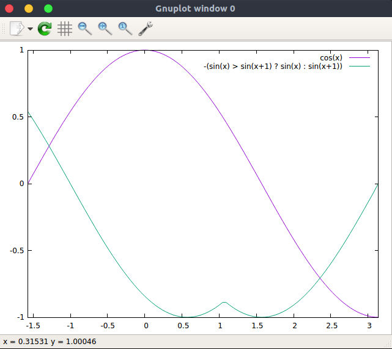

# gnuplot-cpp

A trivial gnuplot interface for c++.

There are [many](https://github.com/search?l=C%2B%2B&q=gnuplot&type=Repositories&utf8=%E2%9C%93) libraries providing the same solution, such as [gnuplot-iostream](https://github.com/dstahlke/gnuplot-iostream). _gnuplot-cpp_ aims at being lightweight and super easy to use. It functions by piping data to a gnuplot subprocess.

## Features
* Header only
* Lightweight (~50 lines of code)
* Easy to use

## Example usage

```c++
#include "gnuplot.h"

int main(){
    GnuplotPipe gp;
    gp.sendLine("plot [-pi/2:pi] cos(x),-(sin(x) > sin(x+1) ? sin(x) : sin(x+1))");
    return 0;
}
```

Result:


